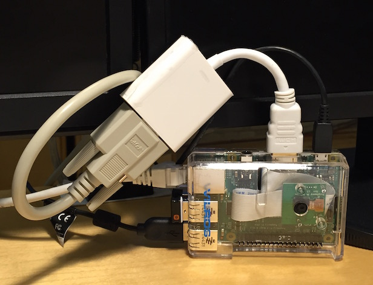
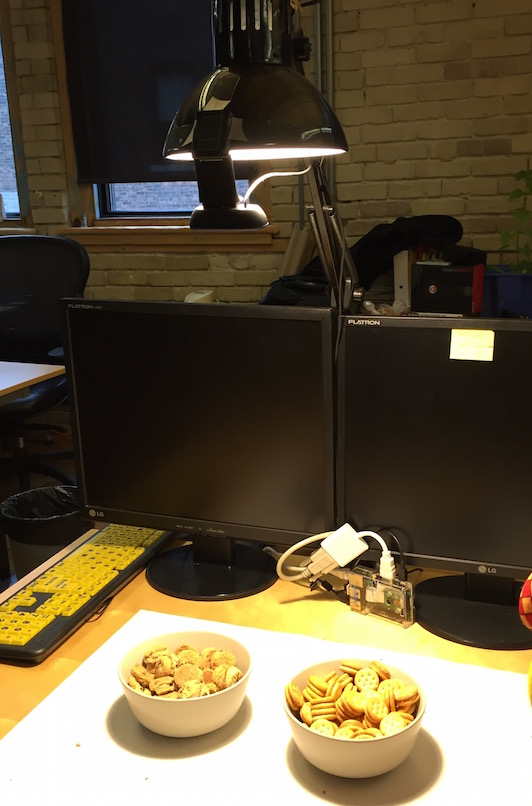
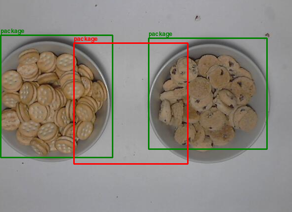
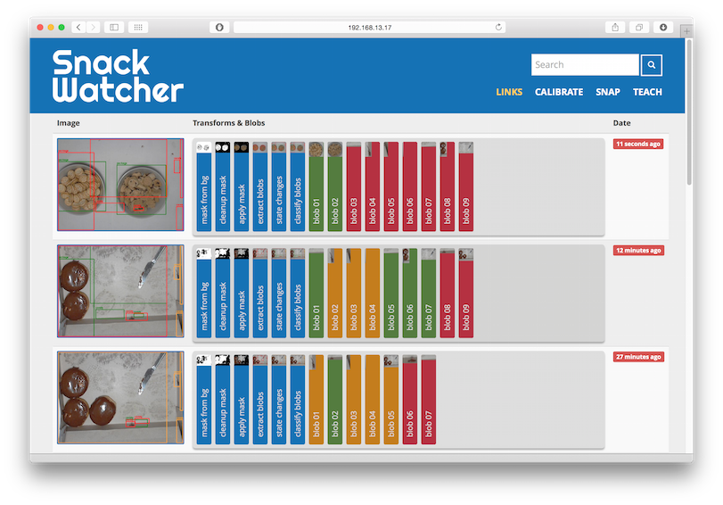
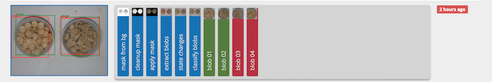
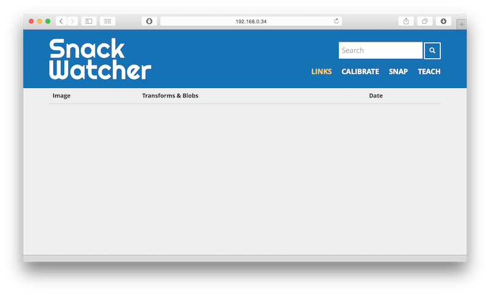
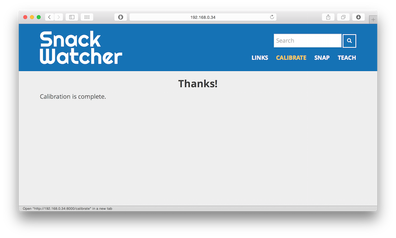
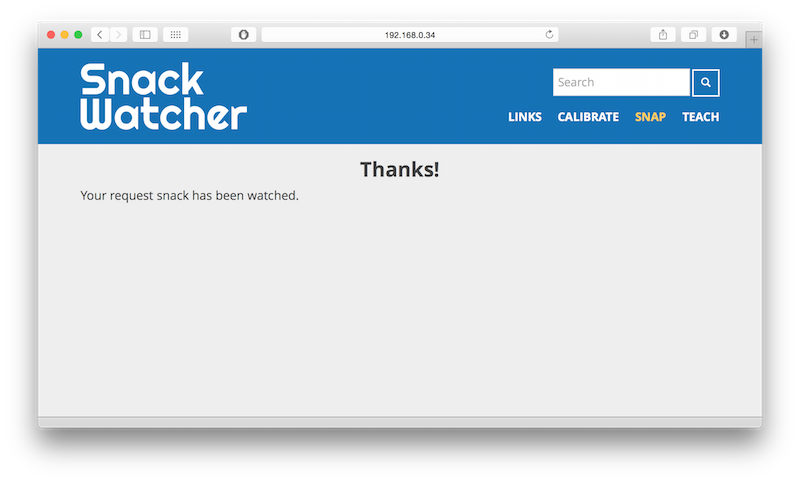
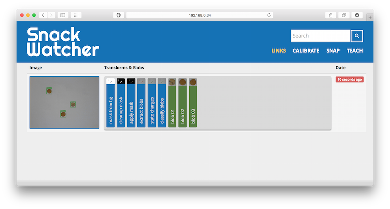

# Snack Watcher
Starting as a [Jonah Group](http://www.jonahgroup.com) working group project, **Snack Watcher** is designed to watch the company's "Snack Table". If there is some new "Snack" presented on the "Snack Table", it could be used to report the event onto a chat channels, email or messaging saying "Snack Happened!", posting an image and trying to classify the snacks that it observed.

It is open source in hope of advancing the sharing spirit and snacking fun within your company!

## Snack Watcher Blog
**Snack Watcher Team** has a blog site hosted at

[Snack Watcher Blog](https://jonahgroup.github.io/SnackWatcher)

posting the latest development articles, interesting researches and on-going discussions on the Snack Watcher project.

# Snack Watcher Web
Before diving into the technical details, a brief overview of how Snack Watcher could benefit the use case of watching a "Snack Table". Also, much effort has been devoted to make it working well with a Raspberry Pi 2 or 3, such that the cost of setup will be minimal and elegant in the geekiest way. The term `snack-web` as a synonym as "Snack Watcher Web" in here.

* Raspberry Pi setup on the "Snack Table"



* Webcam connected to watch at the "Snack Table"



* `snack-web` captured image sample with blob status (green means New, red means removed) and blob classification (they looks like "package" from classifier training)



## snack-web
`snack-web` is a web application showing the result of snack watching, which has been designed to configure and run with Raspberry Pi 2 or 3.
`snack-web` could be driven, either manually (via Web) or programmatically (via RESTful API) to take pictures and push the snapshots into the `static/images` directory. The RESTful API approach to programmatically watch and return the images should be the key feature to integrate with a system, providing greater utilities to report the snack status.

**Note**: `snack-web` will be served from <http://localhost:8000> by default. If this is not the case, replace the hostname with the actual configured site location.

### snack-web Front Page
The following illustrated the front page of `snack-web`, the front page menu items are listed:

- **Links**: display the last N snack captured image and it's processing stages
- **Calibrate**: take a background image for calibrating the background colour
- **Snap**: snap a snack image from the camera now
- **Teach**: (Require advanced setup) Currently still under heavy development, the teaching module is designed to interactively classify snack for future training. This required classifier setup to work.



For each snack image capture, it collects the set of processing stage images for debugging and understanding how the snacks are identified. For each blob that the system detected, it will be stored for displaying and training. The colour coded blobs represent, *green* is the new detected blob, *yellow* is the stationary blob, and *red* is the removed blob. By click on each image bar, a larger image will be shown for detail inspections.



## Install OpenCV and SimpleCV
`snack-web` is built on the popular [OpenCV](http://opencv.org) and [SimpleCV](http://simplecv.org).
OpenCV is a C++ library of programming functions mainly aimed at real-time computer vision. SimpleCV provides the Python wrapper on top of OpenCV, simplified many image processing, classifying and displaying functions.

Learning from this [Install Notes](http://simplecv.readthedocs.org/en/latest/HOWTO-Install%20on%20RaspberryPi.html),
it describes a super easy and fast way to setup your Raspberry Pi with OpenCV with SimpleCV module, avoiding many painful steps described by others blogs

Simply run the following shell commands to install the OpenCV and it's necessary dependencies:

```
sudo apt-get update
sudo apt-get upgrade

sudo apt-get install python-setuptools
sudo apt-get install python-pip
sudo apt-get install ipython python-opencv python-scipy python-numpy python-pygame
```

After all OpenCV and dependencies are installed,
we could proceed to install SimpleCV, a wrapper API that make computer vision really easy. It could be download from github and install from the source.

```
sudo pip install https://github.com/sightmachine/SimpleCV/zipball/master
sudo pip install svgwrite
```

## Setup Requirements

### Install Python Requirements
Assumed that OpenCV and SimpleCV are installed, `snack-web` Python requirements can be installed by,

```
sudo pip install -r requirements.txt
```

### Install MongoDB
`snack-web` is using `mongodb` as the storage for image attributes. The instructions of installing [Raspberry Pi mongodb binaries]( http://andyfelong.com/2016/01/mongodb-3-0-9-binaries-for-raspberry-pi-2-jessie/) should be followed closely, which has been confirmed to work Raspberry Pi 2 & 3.

As a quick `mongodb` service guide,

- starting up the `mongodb` service by

```bash
sudo service mongodb start
```

- checking the status by

```bash
sudo service mongodb status
```

- shutting down cleanly by

```bash
sudo service mongodb stop
```

### Configure System
The default configuration of the system located in `configuration/environment.ini` (refer to the Configuration Keys table for their usage)

## How to Run

## Step 1: Quick Start to Verify
Keys: Debug is True, Use Web Camera is False

The system is set to `DEBUG=True` after the first checkout. When DEBUG is true, instead of using a camera to capture images, the system will be a set of simulated cookie images to demonstrate the system behaviour. At this stage, you simply want to verify the system has been installed and configured properly with MongoDB. The default MongoDB is configured by `DB_CONNECT_STRING` to run on `localhost`.

#### Run System
Once the requirements are installed, mongodb has started and the system has been configured, `snack-web` app is started with:

```
python manage.py runserver
```

Navigate to <http://localhost:8000> to see the `snack-web` front page.



Click `Calibrate` to perform initialization



Click `Snap` to capture an image (simulated image capture since DEBUG=True)



Click `Links` to see the captured image list



### Step 2: Turn On Camera and Action
Keys: Debug is False, Use Web Camera is True

After verifying the system has been installed and connected successfully with Step 1, the camera could be switch ON by `USE_WEB_CAMERA=True`. You can use the `Snap` menu function to force capture an image. You should see the latest captured image has been processed and shown on the `Links` menu. Congratulation! the snack watcher web application is configured and operational.

#### Run System
Once the USB camera has been plugged-in, `snack-web` app is started with:

```
python manage.py runserver
```

Navigate to <http://localhost:8000> to see the `snack-web` front page.

- Click `Calibrate` to perform initialization
- Click `Snap` to capture a Camera image
- Click `Links` to see the captured image list

### Step 3: More Configuration (Optional)
The system is operational after the previous 2 steps. If you like to continue tuning the system behaviours. The following configuration keys are available:

*Table: snack-web Configuration Keys*

| Section | Key | Default | Description |
|---------|-----|---------|-------------|
| system | HOST | 0.0.0.0 | snack-web is serving from this IP address
| system | PORT | 8000 | snack-web is running from this port
| system | DEBUG | True | switch debugging mode
| system | HAS_FTP | False | switch ftp transfer mode
| system | PRE_INIT_CAMERA | False | switch if system should pre-initial the camera
| system | USE_WEB_CAMERA | False | switch if using USB web camera
| system | USE_MOTION_CAMERA | False | switch if using `motion` snapshot as the capture image
| system | MOTION_CAMERA_SNAPSHOT | lastsnap.jpg | location to find motion snapshot image
| system | CROP_IMAGE_BORDER | (25,25) | crop the captured image border by (X,Y) amount. The top left corner from (0,0) to (X,Y) will be used by auto background calibration if BACKGROUND_AUTO_CALIBRATE is True.
| system | SHOW_REMOVED_SNACKS | True | render the removed (disappeared) snacks with red boxes
| system | USE_COLOR_DISTANCE_FOR_BACKGROUND | True | calculate the background difference by color (R,G,B) distance metrics
| system | BACKGROUND_MASK_THRESHOLD | 100 | distance from the calibrated background color which the pixels are thresholded as background.
| system | BACKGROUND_AUTO_CALIBRATE | True | switch if using the top left corner defined by CROP_IMAGE_BORDER as background calibration sample.
| database | DB_CONNECT_STRING | {mongodb URL} | connect to the specified mongodb URL
| database | DB | {mongodb name} | connect to the specified mongodb name
| classifier| USE_CLASSIFIER | False | (Advanced) switch to use `api-classifier` RESTful service to classify a blob from the captured image
| classifier| CLASSIFIER_URL | {api-classifier URL} | (Advanced) connect to the specified `api-classifier` URL for classifying services
| ftp | FTP_HOST | {ftp host} | connect to the specified host for image upload
| ftp | FTP_PORT | {ftp port} | port for remote ftp connection
| ftp | HTTP_PORT | {http port} | port for remote http connection
| ftp | FTP_USER | {ftp username} | ftp username for login if needed
| ftp | FTP_PASS | {ftp password} | ftp password for login if needed

## RESTful API
<http://snack-web:8000/api>
(Replace `snack-web` with your host location.)

The images and operations can also be accessed via RESTful API. The available URI resources are listed in this table.

*Table: snack-web RESTful API*

| API | HTTP | Description |
|-----|------|-------------|
| /snacks/ | GET | return all images, could be a lot of images
| /snacks/snap | GET | take a snapshot and return the latest images. This call takes a snapshot and then processes and returns the generated image.
| /snacks/id/{id} | GET | return image {id}. This call gets an image by the database id. If it is not found, null is returned.
| /snacks/state/{class_state} | GET | Get blobs by class_state. This call gets a list of blobs filtered by c1ass_state.
| /snacks/state | PUT | Update blobs state info by _id. This call accepts a list of id, c1ass, c1ass_state objects and updates the associated blobs in the database.
| /snacks/class/names | GET | Get list of class names. This call returns a list of the possible class names that a blob can be classified by.
| /snacks/last | GET | Get last image. This call returns the latest image by date_created DESC. If none exist, null is returned.
| /snacks/last/{int:n} | GET | Get last n images. This call returns a list of the latest images by date_created DESC.
| /snacks/last/summary | GET | Get lastest summary. This call returns a summary of the latest processed images including the new, duplicate and removed blobs. If no images exist, it returns null.


### Snapshot Naming Convention

When a camera snapshot is taken, The images will be written into a creation  folder according to the snapshot's date-time,

```
snack-{{year}_{month}_{day}}-{{hour}_{minute}_{second}}
```

e.g. `snack-2015_06_17-13_14_58` is created at date `2015-06-17` and time `13:14:58`.


The result JSON for an image, for example, requests for the last image using `curl` command.

```
curl http://snack-web:8000/api/snacks/last
```

For a list of images, for example, requests for all snack images using `curl` command.

```
curl http://snack-web:8000/api/snacks/
```


## Supervisor for Execution Monitoring
Supervisor daemon is a host process, monitoring a running process and starting the monitored process if necessary. On the remote host, the supervisor configuration should be installed under `/etc/supervisor/conf.d` directory.

We have prepared `deployment/supervisor/snack-web.conf` for supervisor, just need to copy to the configuration directory.

```
sudo cp snack-web.conf /etc/supervisor/conf.d/.
```

After the `snack-web.conf` has been installed, we can start the supervisor daemon to monitor the `snack-web` process.

```
sudo supervisord -c /etc/supervisor/supervisord.conf
```


We can further control the supervisor daemon, to see it's status, to start and to stop monitored processes.

```
sudo supervisorctl status
sudo supervisorctl start
sudo supervisorctl stop
```
