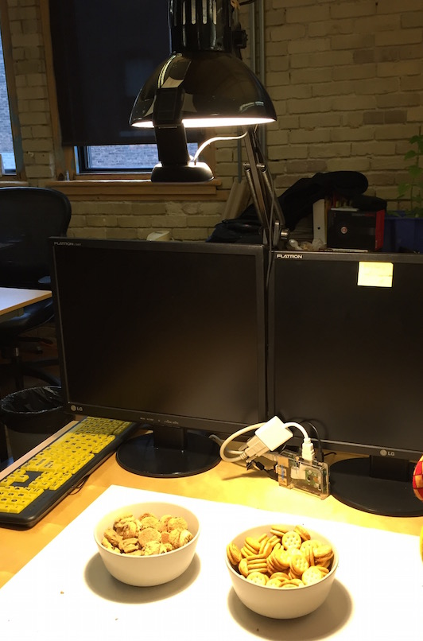

# Snack Watcher

Starting as a [Jonah Group](http://www.jonahgroup.com) working group project,
**Snack Watcher** is designed to watch the company's "Snack Table". If there is
some new "Snack" presented on the "Snack Table", it could be used to report the
event onto a chat channels, email or messaging saying "Snack Happened!", posting
an image and trying to classify the snacks that it observed.

It is open source in hope of advancing the sharing spirit and snacking fun within your company!

[Snack Watcher Repo](https://github.com/jonahgroup/SnackWatcher)

* Webcam connected to watch at the "Snack Table"

* `snack-web` captured image sample with blob status (green means New, red means removed) and blob classification (they looks like "package" from classifier training)

## snack-web
`snack-web` is a web application showing the result of snack watching, which has
been designed to configure and run with Raspberry Pi 2 or 3. `snack-web` could
be driven, either manually (via Web) or programmatically (via RESTful API) to
take pictures and push the snapshots into the `static/images` directory. The
RESTful API approach to programmatically watch and return the images should be
the key feature to integrate with a system, providing greater utilities to
report the snack status.

### snack-web Front Page
The following illustrated the front page of `snack-web`, the front page menu items are listed:

- **Links**: display the last N snack captured image and it's processing stages
- **Calibrate**: take a background image for calibrating the background colour
- **Snap**: snap a snack image from the camera now
- **Teach**: (Require advanced setup) Currently still under heavy development, the teaching module is designed to interactively classify snack for future training. This required classifier setup to work.

For each snack image capture, it collects the set of processing stage images for debugging and understanding how the snacks are identified. For each blob that the system detected, it will be stored for displaying and training. The colour coded blobs represent, *green* is the new detected blob, *yellow* is the stationary blob, and *red* is the removed blob. By click on each image bar, a larger image will be shown for detail inspections.

