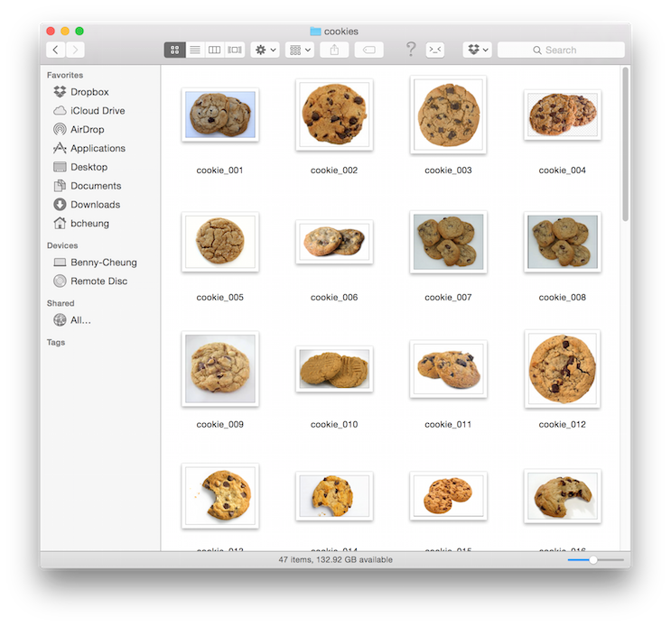
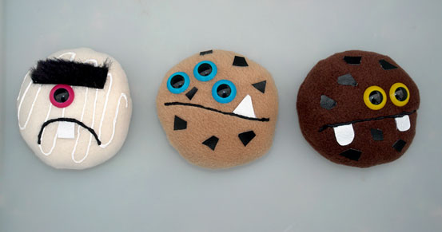
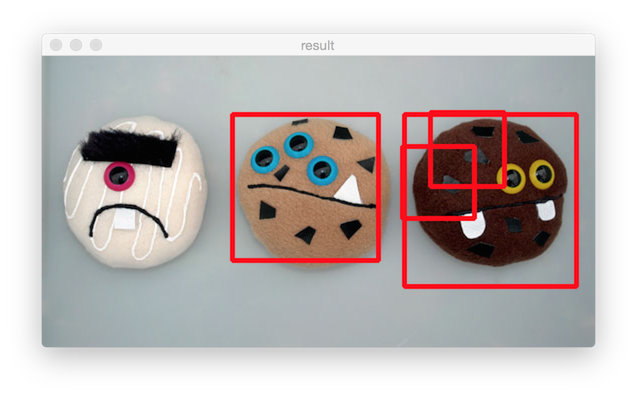

## OpenCV Haar-like Object Detection
Object detetion can be used in many interesting applications, such as:

- Automatic image annoation
- Video surveillance
- Monitoring Inventory
- Shipping
- Military
- Security

But before the object detection, we need to answer:

- What is the object that we want to detect?
- How could we tell the system about the training object?
- How can we test the training results?

With these set of questions in mind, here are the steps that we took.

### Steps to do Object Detection
Definition of Haar-like face detection
<http://docs.opencv.org/master/d7/d8b/tutorial_py_face_detection.html>

Learning from YouTube talks on

- Haar-like feature object detection
<https://www.youtube.com/watch?v=yYXsvC0O0wE>
- OpenCV Tutorial: Training your own detector
<https://www.youtube.com/watch?v=WEzm7L5zoZE>
- Haar Cascade Explaination - Facial Detection
<https://www.youtube.com/watch?v=sWTvK72-SPU>
- Haar Cascade Visualization - seeing how Haar computation in action
<https://www.youtube.com/watch?v=hPCTwxF0qf4>

#### Data Preparation

- Negatives
  - Find a list of images that do not contain the object of interest
    (online datasets, video captures, ...)
  - Try to get many of them
  - Save in a folder and add a text file that includes all the file names

All the snacks that is not cookies,


- Positives
  - Pictures that do contain the object of interest
    (online datasets, video captures, ...)
  - Try to get many of them
  - Save in a folder and add a text file that include file names and marked position of OOI

All the snacks that we think that is cookies,


#### Object Marking
The original `objectmarker` program is written by the CS team of the University of Utah. But we are using an equivalent Python implementation of `object-marker.py` to help us mark the training objects in images.

##### Usage
`object-marker object-output-filename background-output-filename 'file-glob-pattern'`

- `left mouse button` drag to mark object
- `right mouse button` to cancle mark
- `a` to add mark-object
- `s` to save
- `b` toggle current image file is a backgound (contain no object) or not
- `q` exit
- `<left>` save & previous image
- `<right>` save & next image

For example, running it with,
```bash
python object_marker.py cookies.info bg.info 'cookies/*.png'
```

The program generates a text file that contains information as such:

`cookies.info`
```bash
cookies/cookie_001.png 1 535 119 312 599
cookies/cookie_002.png 1 547 124 284 578
...
```

For the background, it save the text file with only the filenames:

`bg.info`
```bash
background/background_001.png
background/background_002.png
...
```

#### Creating Training Samples
Creating a positive vector file by `opencv_createsamples`

```bash
opencv_createsamples -info positives/positives.txt
    -vec data/positives.vec -num 2890 -w 20 -h 20
```

For example, we run with our cookies sample
```bash
opencv_createsamples -info cookies.info \
    -vec cookies.vec -num 56 -w 20 -h 20
```

| option | description |
|--------|-------------|
| -info | specifies the location of the positive samples text files
| -vec | determines where the output vector file will be stored
| -num | is the number of positive samples used
| -w and -h | are the width and height of the rescaled images

#### Running the Trainer
Running the haar training by `opencv_haartraining`

```bash
opencv_haartraining -data data/cascade
    -vec data/positives.vec -bg negatives/negatives.txt
    -npos 2890 -nneg 2977
    -nstage 20 -mem 1000 -model ALL -w 20 -h 20 -nonsym
```

For example, we run with our cookies sample
```bash
opencv_haartraining -data cascade \
    -vec cookies.vec -bg bg.info \
    -npos 56 -nneg 56 -nstage 20 -mem 1000 \
    -model ALL -w 20 -h 20 -nonsym
```

| option | description |
|--------|-------------|
| -bg | provides the path for the negative samples
| -npos | is the number of positive samples used in training
| -nneg | is the number of negatives
| -nstages | is the number of stages to be built for the cascade
| -mem | is the memory allocation for the training process
| -mode ALL | uses the extended set of upright and 45 degree rotated features
| -nonsym | specifies the symmetry is present in the object class


#### Testing

- Use images from online datasets or video captures
- Do not use images from the training datasets
- Test on different scenarios
- Check if further training is required

We have written a Python script `feature_detect.py` to run the Haar-like feature detection. We shall use the Haar training result `cascade.xml` for input.

How to run,
```
python feature_detect.py --cascade cascade.xml test_monster_cookie.jpg
```

`test_monster_cookies.jpg` is having an interesting look,



`test_monster_cookies_detected.png` is the first result that we shall examine carefully about this experiment,



Also, there is a defacto `face.xml` for detecting faces; we can run it by,
```
python feature_detect.py --cascade face.xml some_test_face.jpg
```

We can run the detection algorithm continuously if we have a camera connected. In this example, Mac's camera ID is 0.
```
python feature_detect.py --cascade face.xml 0
```
