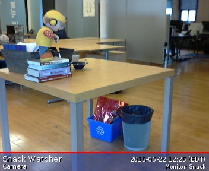
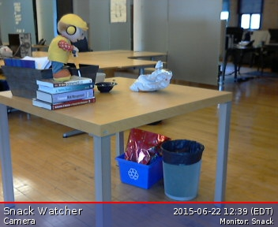
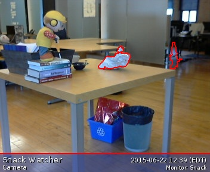

## Snack Detection system

- Sensor (Camera)
- Blob Detection (OpenCV)
    - Snack Detection (OpenCV)
- Reporting Snack (polling if snack has been detected)
- Connecting to Slack Channel (using Slack integration to report back to channel)

### SimpleCV
Open source computer vision module based on OpenCV, making it really simple.

- Image processing
- Video analysis
- Feature detectors
- Object detection

OpenCV comes with C, C++, Python interfaces
Python & OpenCV works together very well

- Support for native Python structures
- Works with NumPy
- Efficient data sharing

#### Blob Detection

- cvBlobsLib
- cvFindContours

#### Background Subtraction

- Foreground Segmentation
- Handle Noisy Background
- Codebook Approach

#### Snack Detection by Support Vector Machine (SVM)

- Supervised Learning
- Classification
- Features
- libsvm <http://www.csie.ntu.edu.tw/~cjlin/libsvm/>

OpenCV interface to SVM
<http://docs.opencv.org/modules/ml/doc/support_vector_machines.html>

Background Subtraction
<http://simplecv-examples.readthedocs.org/en/latest/examples/image-math.html>

### Some Detection Projects for Inspirations
#### A fruit classifier

<http://jmgomez.me/a-fruit-image-classifier-with-python-and-simplecv/>

#### A LEGO classifier
Uses the SimpleCV library and SVM machine learning to classify Lego pieces.

<https://www.youtube.com/watch?v=yupShUY5WS4>

#### Militarizing Your Backyard with Python: Computer Vision and the Squirrel Hordes
Has your garden been ravaged by the marauding squirrel hordes? Has your bird feeder been pillaged? Tired of shaking your fist at the neighbor children? Learn how to use Python to tap into computer vision libraries and build an automated turret to defend your backyard!

<https://www.youtube.com/watch?v=QPgqfnKG_T4>

#### What is Snack-ness?

SVM & classifying blobs by

- blob size
- histogram analysis of blob
- entropy of blob (texture)

### Sample SimpleCV Blob processing
The following code snippet demonstrates the background image subtraction to detect the blobs.
First, we took a reference background image `snack-background`. After some time period, we took
another image `snack-snack1`.

`snack-background`



`snack-snack1`



```python
    img_background = Image("snack-background.jpg")
    img_snack = Image("snack-snack1.jpg")
```

SimpleCV provides convenient image operations (addition, subtraction, multiplication ... many more) to subtract `snack-snack1` from `snack-background`. Then, we thresholded the image (i.e. binarize()) to obtain an black & white image for easier blob detection.

```python
    img_diff = (img_snack - img_background).invert()
    img_diff_bin = img_diff.binarize(thresh=250)
```

We would ignore any blob which size is less than 100 (or any preset size). The detected blob will be drawn on top of the `snack-snack1` image to indicate where are the blobs located.

```python
    snack_blobs = img_diff_bin.findBlobs(minsize=100)
    snack_blobs.draw(color=Color.RED, width=2)
```

We save the result to `snack-result`. Also, we display the `snack-result` on screen.

```python
    img_snack.save("snack-result.jpg")

    while True:
        img_snack.show()
```

`snack-result`



The full example source code is:

```python
    from SimpleCV import *

    img_background = Image("snack-background.jpg")
    img_snack = Image("snack-snack1.jpg")

    img_diff = (img_snack - img_background).invert()
    img_diff_bin = img_diff.binarize(thresh=250)

    snack_blobs = img_diff_bin.findBlobs(minsize=100)
    snack_blobs.draw(color=Color.RED, width=2)
    img_snack.addDrawingLayer(img_diff_bin.dl())

    img_snack.save("snack-result.jpg")

    while True:
        img_snack.show()

```
